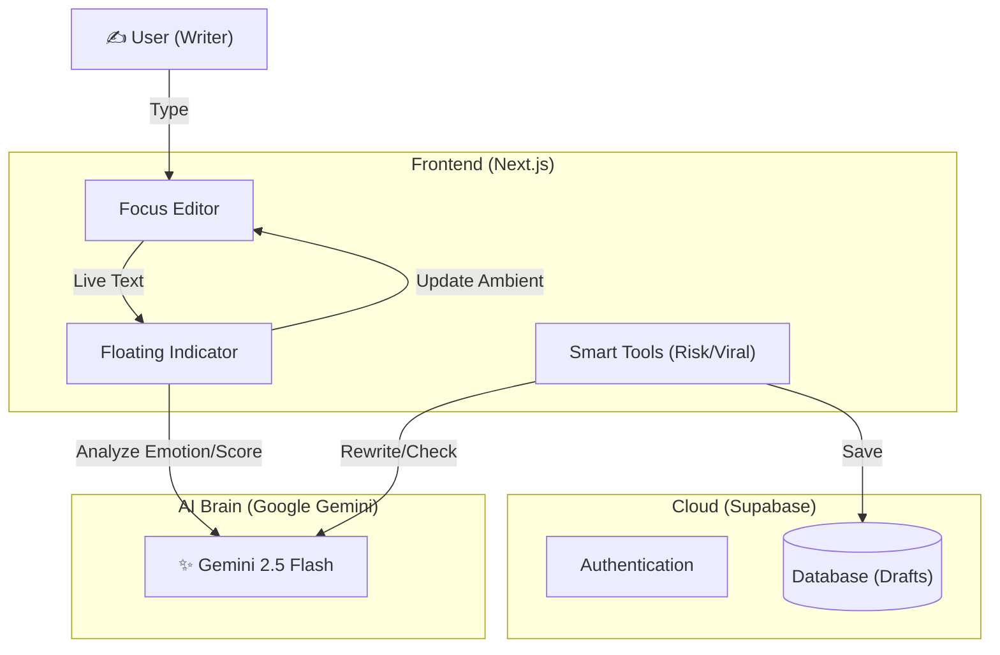

# Kotodama (言霊) - AI Writing Partner ✍️

<p align="center">
  <b>「言葉に、魂を宿す。」</b><br>
  AI-Powered Zen Editor built with Next.js & Gemini 2.5
</p>

---

## 📖 概要 (Overview)

**Kotodama** は、書くことに集中するための「禅」ミニマルエディタと、言葉の力を最大化するAI分析を融合した次世代ライティングツールです。
単なる校正ツールではありません。あなたの書いた文章の「言霊（Kotodama Rate）」をリアルタイムで計測し、感情を可視化。さらに、**「誰が書くか（ペルソナ）」** を定義することで、その人らしい文体へのリライトや、炎上リスクの検知、SNSでの拡散予測までをワンストップで提供します。

## ✨ 主な機能 (Key Features)

### 1. 🧘 Focus Editor (禅エディタ)
* **概要:** 余計な装飾を排した、究極の没入型エディタ。
* **特徴:** `Zen Kaku Gothic New` を採用した美しいタイポグラフィ。文章量に応じてフォントサイズが動的に変化し、常に最適な筆記体験を提供。

### 2. 🔮 Kotodama Analysis (言霊分析)
* **概要:** 文章の「人間らしさ」「熱量」を0-100のスコアで評価。
* **技術:** `Gemini 2.5 Flash` を使用。感情分析により、書いている内容に合わせて背景のアンビエントカラーが変化（Joy, Trust, Urgencyなど）。

### 3. 🧬 Persona DNA (ペルソナ共鳴)
* **概要:** 「誰として書くか」を設定可能。
* **機能:** ユーザーの職業、性格、背景（DNA）をAIにインプットすることで、単なる修正ではなく「その人らしい」表現へのリライトを実現。

### 4. 🛡️ Risk Management (炎上対策)
* **概要:** SNS投稿前のリスクチェック。
* **機能:** 炎上リスク（Hate/Leak）を3段階で診断し、ワンクリックで「意見を変えずに表現だけをマイルドにする」自動修正が可能。さらに、**Anti-Scan機能**により、不可視文字ノイズを混入させ、AIのスクレイピング学習を阻害する保護機能も搭載。

### 5. 🚀 Smart Publisher & Viral (拡散予測)
* **概要:** 各プラットフォーム（Note, Qiita, Zenn, X/Twitter）に最適な形式へ自動変換。
* **機能:** 「この投稿はどれくらい伸びるか？」を予測するViral Checkerを搭載。インプレッション数予測と改善アドバイスを提供。

---

## 🛠 技術スタック (Tech Stack)

| Category | Technology | Usage |
| :--- | :--- | :--- |
| **Frontend** | **Next.js 14** (App Router) | React Server Components, TypeScript |
| **Styling** | **Tailwind CSS** | Utility-first styling, Framer Motion (Animations) |
| **Backend** | **Supabase** | Auth (Magic Link), Database (Drafts) |
| **AI Model** | **Google Gemini 2.5** | Flash (Real-time Analysis, Rewrite, Risk Check) |
| **Deployment** | **Vercel** | Edge Functions compatible |

---

## 🏗️ アーキテクチャ (Architecture)



---

## 🚀 セットアップ (Getting Started)

### 1. Prerequisites
- Node.js 18+
- Supabase Account
- Google AI Studio API Key

### 2. Environment Variables
ルートディレクトリに `.env` ファイルを作成してください。

```bash
NEXT_PUBLIC_GEMINI_API_KEY=your_gemini_api_key
NEXT_PUBLIC_SUPABASE_URL=your_supabase_url
NEXT_PUBLIC_SUPABASE_ANON_KEY=your_anon_key
```

### 3. Run
```bash
npm install
npm run dev
```

---

## 👨‍💻 開発者 (Developer)
Enludus (Information Science Student)

Focus: AI-Native App Development, Game Creation

Contact: nakinakipal@gmail.com / <https://enludus.vercel.app>

<p align="center"> 
    © 2025 Enludus. All rights reserved. 
</p>
